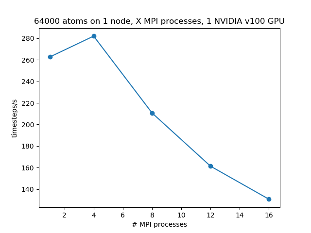
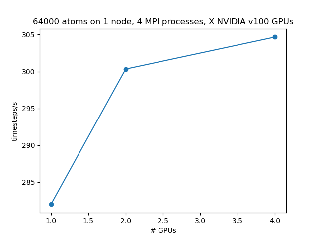

# LAMMPS performance tests on UL cluster

The tests were done by running the collision simulation in 3C-SiC for $3 \times
10^{4}$ timesteps on the _clara_ cluster at Uni Leipzig scientific computing
center, using MPI parallelization and calculating the Tersoff pair interactions
on NVIDIA GPUs.

## Scaling with number of MPI processes

## Scaling with number of GPUs

